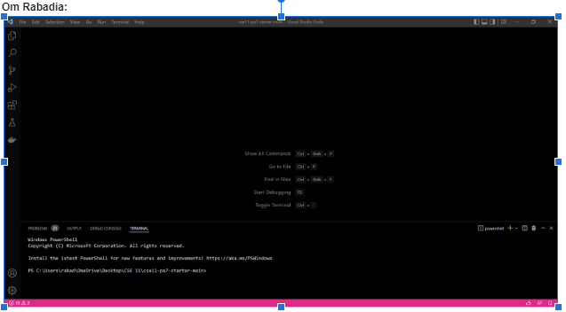
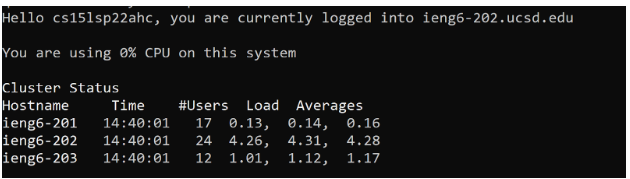
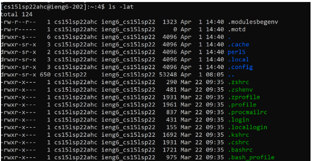
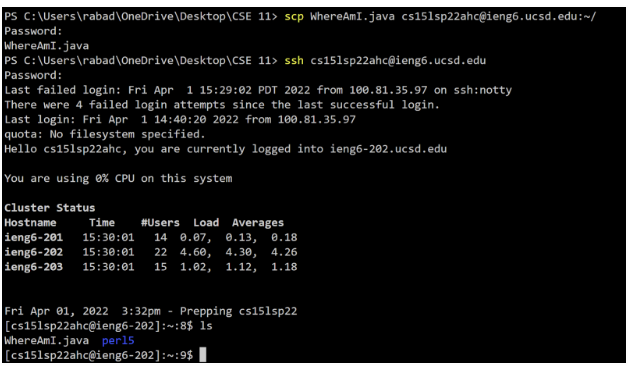
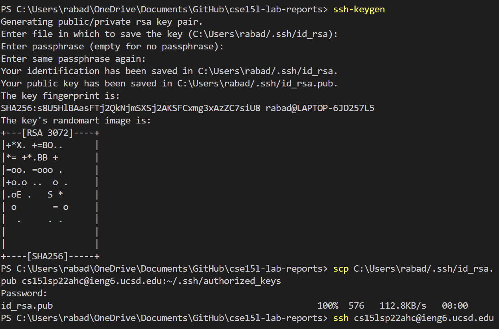
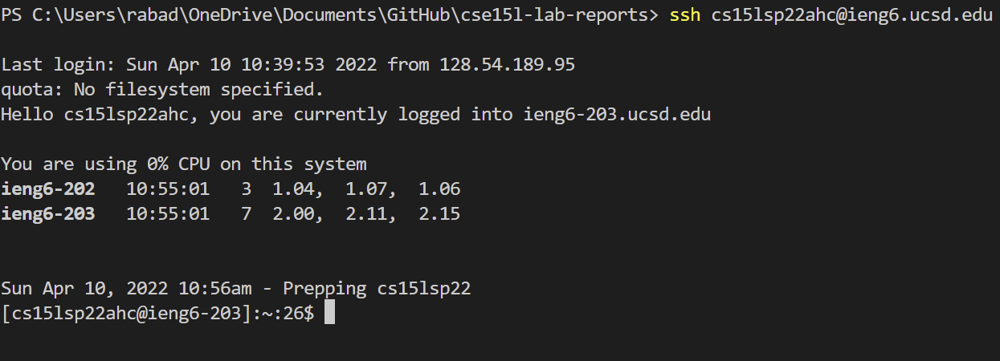
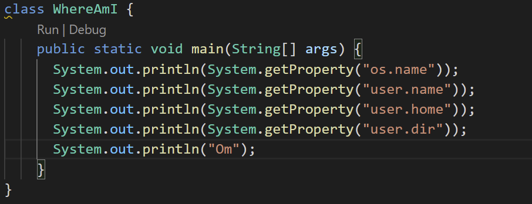
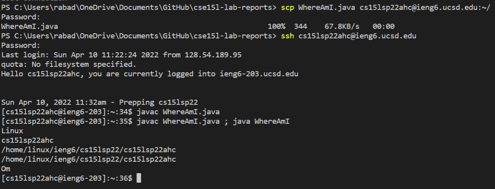

# Lab Report 1 || Week 2
Before starting the lab, I had to reset my password using [this link](https://sdacs.ucsd.edu/~icc/index.php). I looked up my account info, and followed instructions in order to change my password globally. 
### Installing Visual Studio Code
 - I went to the [VS Code website](https://code.visualstudio.com/). I used the installer provided on the website. 

 

### Remotely Connecting
- First, I installed [OpenSSH](https://docs.microsoft.com/en-us/windows-server/administration/openssh/openssh_install_firstuse).
-Then I looked up my course account for 15l using this [website](https://sdacs.ucsd.edu/~icc/index.php). We used the same link to look up our account and change our password.
- Then, I opened up a terminal in vscode (Ctrl + ` ) and entered: 

`ssh`

`cs15lsp22ahc@ieng6.ucsd.edu` <-- (the account you found on the website)

`yes`

`password` (Actually enter your password)

- Then I successfully connected, with this being the output:

### Trying Some Commands

`ls -lat`

(Shows directories/files, and info associated with such files/directories)

- Some other useful commands that can be used: 

`cd`

`cd ~`

`ls`

`cat`

`cp`

### Moving Files with scp

- I created a file in VScode, and I used scp, followed by the filename, and the email I used to login. I remotely connected, then I used ls to show files, and the file I created was there.

### Setting an SSH Key

- Locally, I ran the command:

`ssh-keygen`

- Then I entered the local path for .ssh/id_rsa, and a key was generated. This was done by hitting enter 3 times.
-Then I copied the key over to the sever by entering

`scp C:\Users\rabad/.ssh/id_rsa.pub cs15lsp22ahc@ieng6.ucsd.edu`

- Then I logged onto the server, copied the keys, and now I can login without the need of a password

`ssh cs15lsp22ahc@ieng6.ucsd.edu`

### Optimizing Remote Running

-I still need practice in this area, as I had trouble with the keygen, so it took extra keystrokes to type in the password. Other than that, I used up arrow to summon commands and ; to run multiple commands on one line. Minus the password, it took me about 10 keystrokes after I edited WhereAmI.java

