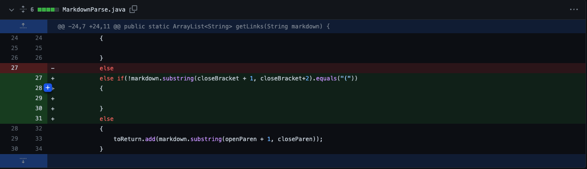

# Lab Report 2 || Week 4

## Code Change 1

[Link to the ImageReference.md test file](https://github.com/omr272/markdown-parser/blob/main/ImageReference.md?plain=1)

The symptom/output of running ImageReference.md on our MarkdownParse File

### Relationship between the bug, symptoms, and failure-inducing input #1
- Images are not supposed to detected as links. When ImageReference.md is given as an input, an empty bracket is supposed to be returned, but when we ran it on our code, the output was:

`[image.link]`

- Our code is only looking for connections between closing/opening brackets/parenthesis, so it is not concerned with what is a link or not; anything could be placed in the brackets/parenthesis, so we made the fix to detect the "!" in front, and if it apparent, the image code following would not be added.

## Code Change 2

[Link to the FarApart.md test file](https://github.com/omr272/markdown-parser/blob/5de6709b032fd7a5ec0d1248fb6621e4ea8ea011/FarApart.md)

The symptom/output of running FarApart.md on our MarkdownParse File

### Relationship between the bug, symptoms, and failure-inducing input #2
- If the open parenthesis does not come directly after the closing bracket, there should be no consideraton for the text to be a link. However, our code just looks for text within a set of parenthesis, no matter how far the parenthesis is from the ending bracket, meaning our code produces the output

`[just kidding]`

- even though it is not remotely close the closing bracket, and it is not a link.

## Code Change 3

[Link to the MyTest.md test file](https://github.com/omr272/markdown-parser/blob/main/MyTest.md)

The symptom/output of running MyTest.md on our MarkdownParse File

### Relationship between the bug, symptoms, and failure-inducing input #3

- The code should output each 3 of the links in one singlular list, such as:

`[https://google.com, google.html, abc.com]`

- but the code enters a infinite loop because the code keeps searching for a new set of brackets after the last line, leading to a Heap space error. Adding:

`if (openBracket == -1) {break;}`

- breaks the infinite loop because the moment there is no openBracket after the closeParen, the loop breaks and the result is outputted

 
 

