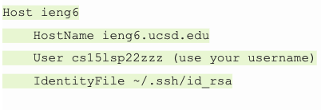

# Lab Report 3 || Week 6

## Streamlining ssh Configuration

- Image of my .ssh/config file

- To edit this, I used VS code, as well as a series of VIM commands
- These are the commands I used (on my local machine)

```cd /Users/om/.ssh``` (to navigate to the directory)

```touch config``` (to create the file)

```vim config``` (to open it using vim)

```i``` (to edit the file)

- I then pasted:

- but replaced zzz with ahc
- Hit esc to exit insert mode, and to save my changes, I used

```:wq```

- Now I can login effortlessly by using:

```ssh ieng6```

- as seen below:


### Copying a file using the alias
- Below are screenshots of me using

```scp```

- to copy a file to the server using solely the alias


## Setting up Github Access from ieng6
### Public Key
- The public key is stored on Github at [github.com/settings/keys](https://github.com/settings/keys)


- On my local machine and from my user directory, I entered

`cd .ssh` 

- and there it was, seen below


### Private Key

-The same steps were used to find the private key


### Git Commands
- I edited MarkdownParse.java by removing the link at the top

- I removed the link using `i` and used
`:wq` to save

- Below is me committing and pushing the change on my ieng6 account


[This is the link to the commit](https://github.com/omr272/markdown-parsercopy/commit/a6d08e07646483558ab611f8f58eafbf44b6d9fa)

## Copying Whole Directories with `scp -r`
- I first navagated to the directory I wanted to copy. I wanted to copy "/Users/om/Desktop/markdown-parser"
- I used `pwd` to show the directory
- I then used `scp -r . ieng6:~/markdown-parser; ssh ieng6; cd markdown-parser; javac -cp .:lib/junit-4.13.2.jar:lib/hamcrest-core-1.3.jar MarkdownParseTest.java; java -cp .:lib/junit-4.13.2.jar:lib/hamcrest-core-1.3.jar org.junit.runner.JUnitCore MarkdownParseTest` to copy the directory, login to the server, and run the tests
- *NOTE* I used `;` to combine multiple commands
- *NOTE* the `.` is the current directory and source
- *NOTE* I used the alias name instead of my whole username


- markdown-parser was successfully copied, but when the tests were ran, it compiled, but there was an error that most likely has to do with the lib files, but I am not sure how to fix this error as I have the most up-to-date Junit files, and my tests pass on my local machine.


        


