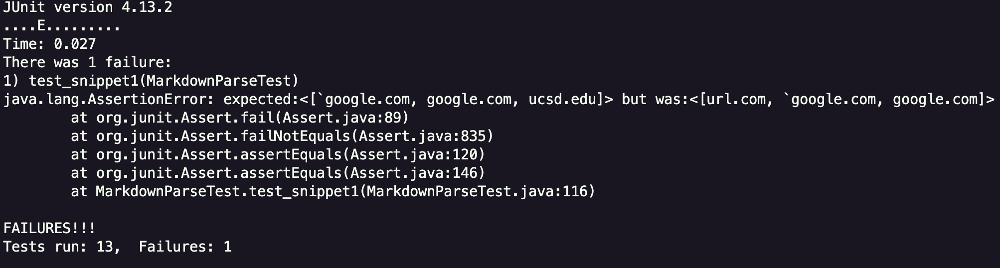

# Lab Report 4 || Week 8

- My Repository Link
[omr272](https://github.com/omr272/markdown-parser)
- Link to Repository we reviewed [richmass1](https://github.com/richmass1/markdown-parser)

## Snippet 1
### Expected Output
- According to the [Common Mark Demo Site](https://spec.commonmark.org/dingus/), the output should be the last 3 links: `google.com, google.com, ucsd.edu

### On my MarkdownParse.java
- I put snippet 1 into its own Markdown file and this is how I turned the test into code

- When running Snippet 1 on my code, the test failed

### On Reviewed MarkdownParse.java
- I put snippet 1 into its own Markdown file and this is how I turned the test into code

- When running Snippet 1 on their code, the test failed:

## Snippet 2
### Expected Output
- According to the [Common Mark Demo Site](https://spec.commonmark.org/dingus/), the output should be: a.com, a.com(()), example.com

### On my MarkdownParse.java
- I put snippet 2 into its own Markdown file and this is how I turned the test into code

- When running Snippet 2 on my MarkdownParse.java, the test failed

### On Reviewed MarkdownParse.java
- I put snippet 2 into its own Markdown file and this is how I turned the test into code

- When running Snippet 2 on their MarkdownParse.java, the test failed

## Snippet 3
### Expected Output
- According to the [Common Mark Demo Site](https://spec.commonmark.org/dingus/), the output should be: https://sites.google.com/eng.ucsd.edu/cse-15l-spring-2022/schedule

### On my MarkdownParse.java
- I put snippet 3 into its own Markdown file and this is how I turned the test into code

- When running Snippet 3 on my MarkdownParse.java, the test failed

### On Reviewed MarkdownParse.java
- I put snippet 3 into its own Markdown file and this is how I turned the test into code

- When running Snippet 3 on their MarkdownParse.java, the test failed

# Questions

### 1. Do you think there is a small (<10 lines) code change that will make your program work for snippet 1 and all related cases that use inline code with backticks? If yes, describe the code change. If not, describe why it would be a more involved change.

- My MarkdownParse.java does not address the use of backticks at all. I could use an if statement that checks for a backtick, and if a openBracket or openParenthesis is within a backtick, it should not be counted as a link. However, there are many problems that could arise with this code change, so a more involved change with debugging may be required.

### 2. Do you think there is a small (<10 lines) code change that will make your program work for snippet 2 and all related cases that nest parentheses, brackets, and escaped brackets? If yes, describe the code change. If not, describe why it would be a more involved change.

- The code change required to fix this error is a more involved one. It would require numerous if statements that check for more openBrackets after an index for an initial openBracket is found, telling the program to look for another closing bracket. The parenthesis also have to be in the right spaces for it to be a link, and checking for that with numerous sets of brackets might be an issue that creates a lot of bugs.

### 3. Do you think there is a small (<10 lines) code change that will make your program work for snippet 3 and all related cases that have newlines in brackets and parentheses? If yes, describe the code change. If not, describe why it would be a more involved change.
- There could be an if statement that checks for new lines and skips them, but I am not too sure what breaks the code, and how twitter.com is not considered to be a link. Theoretically, there is a closing bracket after the new line and an openParen right next to the closeBracket. A deeper analysis of the program is required, and it will create a plethora of bugs and symptoms.

