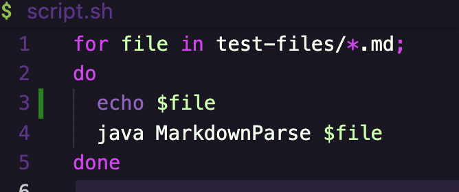
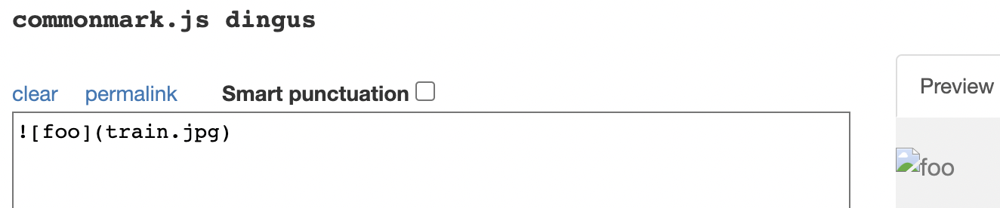
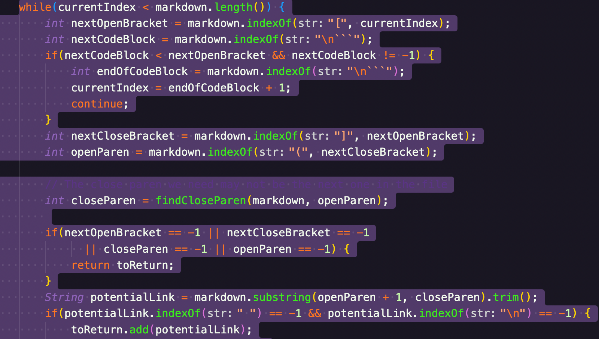
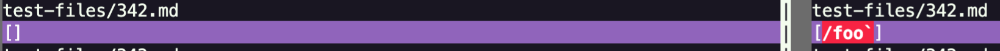
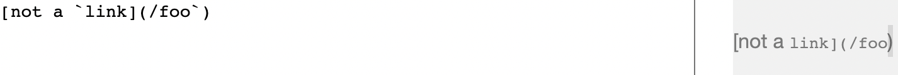

# Lab Report 5 || Week 10

## How I evaluated the tests w/ different results

- I copied the provided test-files folder to my markdown-parser directory, which meant that the test-files were now in both the provided and my implementation of Markdown-Parser.
- I used a bash script that uses a for-loop, as pictured below

- I copied the script from the provided directory to the my MP (markdown-parser) directory using ```cp script.sh /Users/om/Desktop/markdown-parser```
- In my own markdown-parser directory, I output the results to a file using ```bash script.sh > myoutput.txt```
- In the provided directory, I output the results to a file using ```bash script.sh > providedoutput.txt```
- To compare the results, both output files need to be in the same directory, so I copied ```cp providedoutput.txt /Users/om/Desktop/markdown-parser```
- I navigated to my MP directory, and ran ```vimdiff myoutput.txt providedoutput.txt``` to compare the different results

## [577.md](https://github.com/omr272/markdown-parser/blob/main/test-files/577.md) (Test 1)
Results (myoutput.txt on left, providedoutput.txt on right)

- According to the [Common Mark Demo Site](https://spec.commonmark.org/dingus/), the output should be `[]` 
- My MP implementation is correct

### Issue with Provided Implementation and Fix
- The provided implentation does not address "!" within the code. If there is an exclamation mark, the close/OpenParen & close/OpenBracket should be neglected


An if statement to address !'s should be placed in the while loop in the getLinks method.

## [342.md](https://github.com/omr272/markdown-parser/blob/main/test-files/342.md) (Test 2)
Results (myoutput.txt on left, providedoutput.txt on right)

- According to the [Common Mark Demo Site](https://spec.commonmark.org/dingus/), the output should be `[]` 
- My MP implementation is correct

### Issue with Provided Implementation and Fix
- The provided implentation does not check for backticks, and code within the backticks, including any bracket or Parenthesis should not be counted or recorded.


An if statement to address backticks, telling the program to continue if the index of a paren/bracket is found within a backtick should be placed within the while loop for the getLinks method


